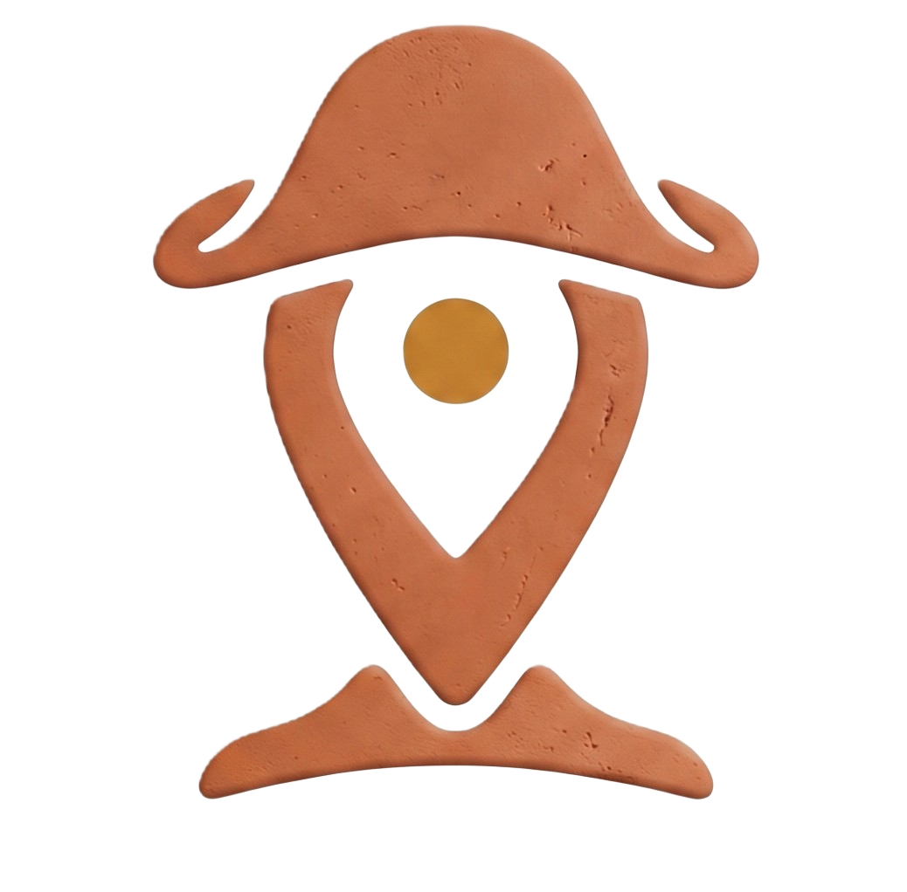

# Ponto da Terra

O projeto Ponto da Terra está sendo desenvolvido com o objetivo de criar uma aplicação web full stack voltada para o Artesanato Pernambucano, visando solucionar o seguinte problema:

Artesãos e produtores criativos têm pouca visibilidade digital, dependem de intermediários e têm gestão precária de catálogo, pedidos e estoque. Falta um canal que conecte essa produção a compradores destacando origem, técnica e o impacto de comprar direto de quem faz.

## A Solução
Uma aplicação web full stack com vitrine do comprador (busca, filtros, perfil do artesão, carrinho, avaliações), painel do artesão (catálogo, estoque, pedidos) e painel administrativo, contando também com indicadores de venda. O objetivo é criar uma plataforma que conecte artesãos e empreendedores a compradores de todo o país, valorizando a técnica e a origem de cada peça. 

## Requisitos por disciplina

* **Desenvolvimento Web:** 
  Construir a aplicação web full stack, que é o núcleo do produto. Isso inclui o frontend responsivo (vitrine, busca, carrinho, perfis) e o backend (API e regras de negócio), integrando as demais partes como banco de dados e processamento assíncrono.

* **Requisitos, Projeto de Software e Validação:** 
  Ficar responsável por analisar o domínio, definir e gerir os requisitos, embasar as decisões de arquitetura e projeto (usando princípios SOLID/GRASP e padrões de projeto), além de conduzir a estratégia de testes e validação contínua da solução.

* **Fundamentos de Computação Concorrente, Paralela e Distribuída:** 
  Garantir o desempenho, a escalabilidade e a tolerância a falhas do sistema. Isso é feito aplicando conceitos de concorrência (como no checkout e na baixa de estoque), paralelismo e arquitetura distribuída, utilizando filas e processamento assíncrono.

* **Projeto 4 (Disciplina de Projeto):** 
  Atuar como ponto focal para acompanhar o processo, a organização do time, o planejamento, a evolução das sprints e a integração entre todas as disciplinas. O foco é metodológico e de gestão, não avaliando o mérito técnico das outras áreas.

### Requisitos detalhados
- [Lista](https://app.notion.com/p/Projeto-Integrador-3c996fcfd27080df9bf3ef635f5bdf99?source=copy_link)

  
## 📋 Índice

* [Entrega 1](#entrega-1)
* [Entrega 2](#entrega-2)
* [Entrega 3](#entrega-3)
* [Entrega 4](#entrega-4)
---

## Entrega 1

- [Backlog - Trello](https://trello.com/b/KZIZUnYE/ponto-da-terra)
- [Diagrama de Casos de Uso](add)
- [Diagrama de Classes](add)

##  Entrega 2

##  Entrega 3
  
##  Entrega 4

### Issues/Bug Tracker
- [Issues](https://github.com/comparoto/Ponto-da-Terra/issues)

## 👩‍💻 Equipe 
- [Iza Malafaia](https://github.com/Iza-Malafaia) 
- [Juliana Comparoto](https://github.com/comparoto) 
- [Joanna Farias](https://github.com/Joanna-Farias) 
- [Lucas Vinícius](https://github.com/Lucas-Viniicius)
- [Maria Luiza](https://github.com/alumiria)
- [Paulo Marrocos](https://github.com/paulosds2318)
- [Pedro Marrocos](https://github.com/Pedrinhosds16)

## ⚙️ Guia 
Montando o ambiente corretamente para execução do projeto:

🌐 <b>1. Tecnologias Utilizadas</b>

* **Backend:** 
* **Banco de Dados:**
* **Frontend:** 

🛠️ <b>2. Como Configurar e Executar o Projeto</b>

Siga os passos abaixo para montar o ambiente e rodar a aplicação localmente na sua máquina.

### 1. Pré-requisitos

### 2. Clonar o Repositório

### 3. Abrir e Compilar na ID

### 4. Executar a Aplicação

🌐 <b>3. URLs de acesso</b>

